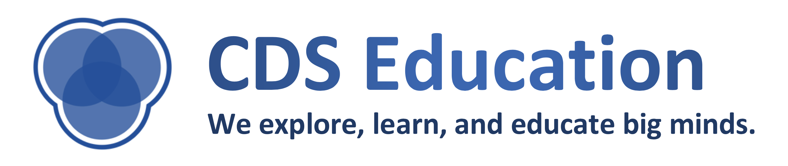

## Who we are:
The CDS Education subteam exists to provide training courses on both fundamental machine learning materials and cutting edge technologies, providing a stepping stone to prospective applicants and CDS project teams.

and more

**Advisor:** [Professor David Mimno](https://mimno.infosci.cornell.edu/)  
**Team Leads:** [Jared Lim](https://github.com/JunyoungLim) (CS 2020)  
**Course Instructors:**
* ML Course  
  * [Jared Lim](https://github.com/JunyoungLim) (CS 2020)  
  * [Abby Beeler](https://cornelldata.science) (CS 2020)  
* DL Course  
  * [Ryan Butler](https://cornelldata.science) (CS 2019)  
  * [Yuji Akimoto](https://cornelldata.science) (CS 2019)  
* DE Course  
  * [Dae Won Kim](https://cornelldata.science) (ORIE MENG)  
  * [Haram Kim](https://cornelldata.science) (CS 2020)  

## Team objectives:
* and more

## Education Materials:
* and more

## Members (FA2017):
* and more
